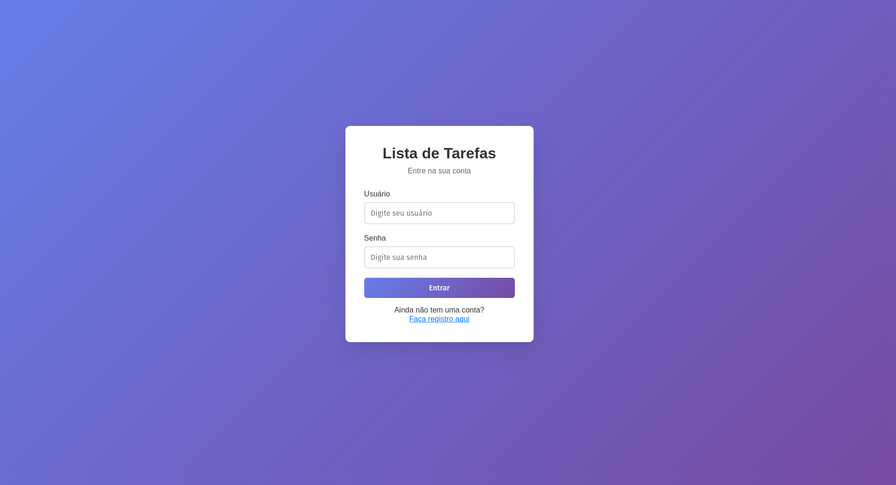
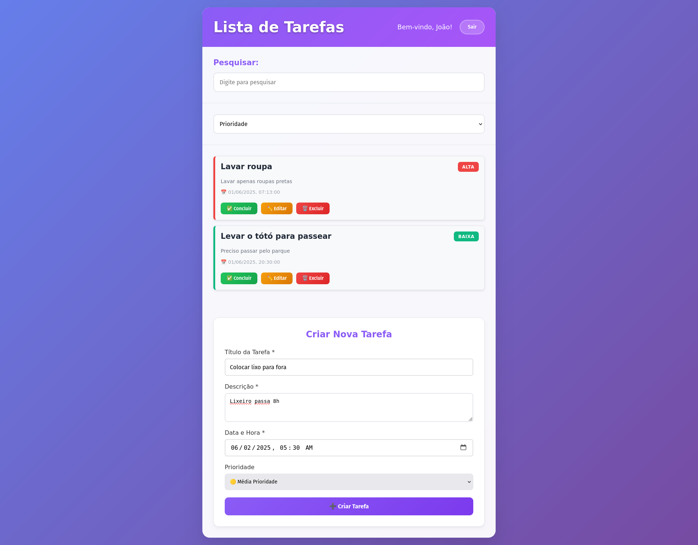
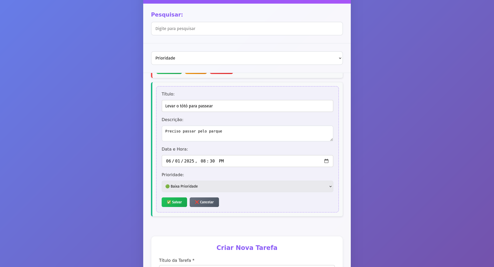

# Gerenciador de Tarefas - Frontend

Este repositório contém o frontend de um sistema de gerenciamento de tarefas com autenticação de usuários. A aplicação permite criar, visualizar, atualizar e excluir tarefas pessoais com diferentes níveis de prioridade.

> **Nota:** O backend deste projeto está disponível em um repositório separado.

## 🔗 Link do Projeto

[MegaJr - Frontend](https://github.com/Joao-Gabriel-Salomao/MegaJr) <br>
[MegaJr - Backend](https://github.com/AbelardoOk/toDoList-Mega) <br>
[Documentação Completa](https://docs.google.com/document/d/13334wMwtTlZCZsV0eSGxtsVFxKBCa5G7zJau6qISgv8/edit?usp=sharing)

---

# 🖼️ Demonstração da Aplicação

Abaixo estão algumas capturas de tela que ilustram as principais funcionalidades da aplicação:

## 📌 Tela de Login



## 🗂️ Lista de Tarefas



## ✏️ Edição de Tarefa



> **Nota:** Para adicionar suas próprias capturas de tela, salve as imagens na pasta `assets/` e atualize os caminhos das imagens acima conforme necessário.

---

# 🖥️ Tecnologias Utilizadas

- [Vite.js](https://vitejs.dev/)
- [React](https://reactjs.org/)
- [TypeScript](https://www.typescriptlang.org/)
- [React Router](https://reactrouter.com/)

---

# ⚙️ Funcionalidades

- Autenticação de usuários (login e registro)
- Criação, visualização, edição e exclusão de tarefas
- Atribuição de níveis de prioridade às tarefas
- Filtragem e ordenação de tarefas
- Interface responsiva para dispositivos móveis e desktops

---

# 🚀 Instalação e Execução

1. Clone o repositório:

   ```bash
   git clone https://github.com/Joao-Gabriel-Salomao/MegaJr.git
   ```

2. Navegue até o diretório do projeto:

   ```bash
   cd MegaJr
   ```

3. Instale as dependências:

   ```bash
   npm install
   ```

4. Inicie o servidor de desenvolvimento:

   ```bash
   npm run dev
   ```

5. Acesse a aplicação no navegador:
   ```
   http://localhost:5173
   ```

---

# 📁 Estrutura de Pastas

A estrutura de pastas segue uma organização modular para facilitar a manutenção e escalabilidade:

```
MegaJr/
├── assets/
│   └── screenshots/
├── public/
├── src/
│   ├── components/
│   ├── contexts/
│   ├── pages/
│   ├── services/
│   ├── styles/
│   ├── App.tsx
│   └── main.tsx
├── .env
├── index.html
├── package.json
├── tsconfig.json
└── vite.config.ts
```

---

# 👥 Responsáveis pelo Projeto

- João Gabriel Salomão - [@Joao-Gabriel-Salomao](https://github.com/Joao-Gabriel-Salomao)
- Vitor Alex Valenzuela - [@Vitor-Valenzuela](https://github.com/Vitor-Valenzuela)
- Abelardo Palácios Ribeiro - [@AbelardoOk](https://github.com/AbelardoOk)
- João Leonardo Macanhão - [@João-Macanhão]()

---

# 📌 Considerações

- Certifique-se de que o backend esteja em execução e acessível para que o frontend funcione corretamente.
- As variáveis de ambiente necessárias devem ser definidas no arquivo `.env`.
